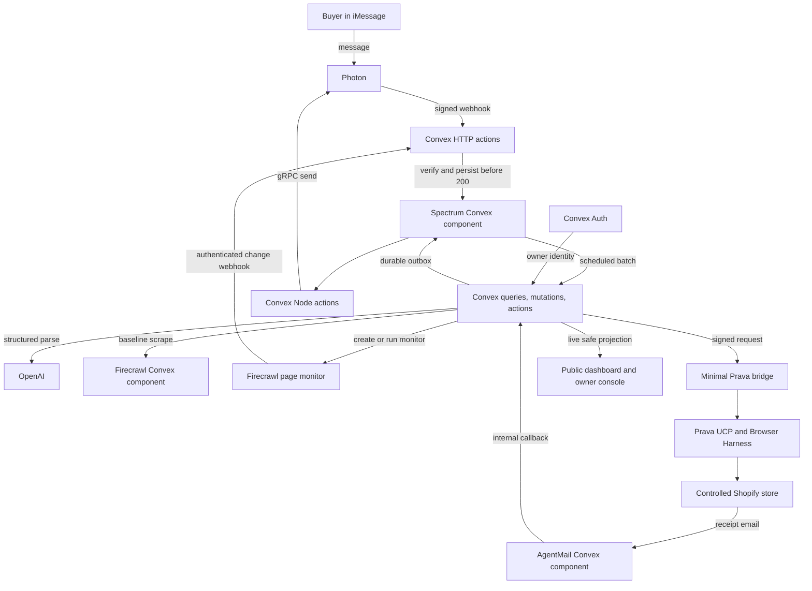
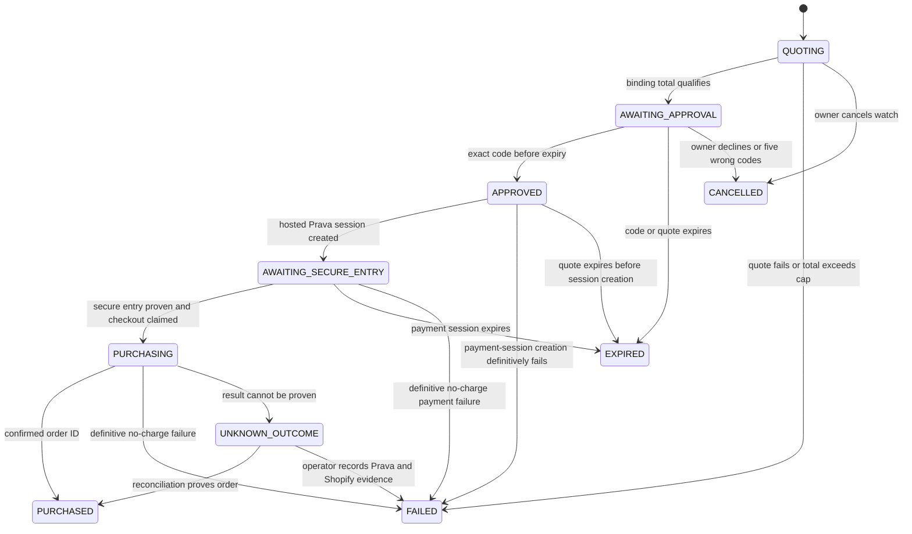
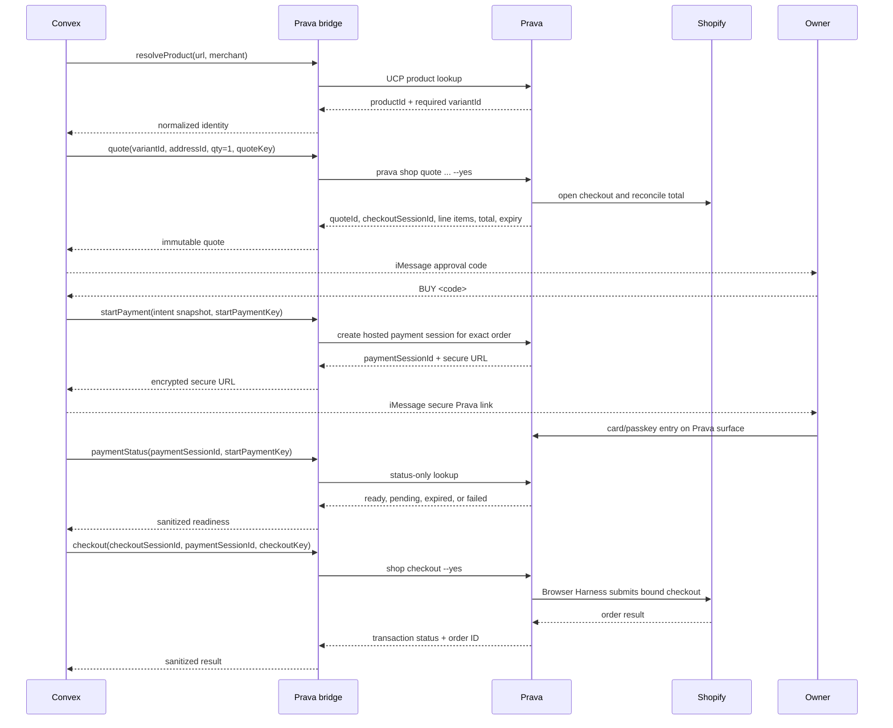

# Design: iMessage Product Watch and Purchase Agent

> **Future design:** This document is aspirational, not current app behavior. AgentMail receipt matching and Prava checkout were not shipped.

Generated on 2026-09-19  
Branch: `main`  
Status: BLOCKED ON PROVIDER PROOFS  
Mode: Builder

## Audience and purpose

This document is for the engineer implementing the hackathon version. It defines the smallest complete system that can watch one product from a controlled Shopify store, request an exact purchase approval through iMessage, complete the order through Prava, and report the receipt through AgentMail.

Do not start application implementation until the six provider proofs in [Implementation gate](#implementation-gate) pass. The uncertain part is provider interoperability, not the Convex state machine.

## Problem statement

A buyer sends a controlled Shopify product URL through iMessage and names an exact variant and maximum delivered price. The agent watches that item, obtains a shipping-and-tax-inclusive quote after a qualifying price change, asks for explicit approval, and purchases only that approved order.

## Product loop

1. The buyer sends a URL, variant, quantity, and delivered-price limit.
2. Prava UCP resolves the exact Shopify variant.
3. A Firecrawl page monitor watches structured price and availability fields and sends meaningful-change webhooks to Convex.
4. Convex validates the Firecrawl snapshot, then Prava creates the authoritative delivered-total quote.
5. Photon sends the immutable quote and a short-lived approval code.
6. The buyer replies with that exact code.
7. The buyer completes Prava's secure hosted card or passkey step.
8. Prava Browser Harness completes Shopify checkout.
9. AgentMail matches the Shopify receipt.
10. Photon reports the confirmed order.

The closed purchase loop is the product. Price tracking alone is not.

## MVP scope

### Included

- One preconfigured owner.
- One controlled Shopify store.
- One exact UCP-resolved product variant.
- USD, quantity one, and one active watch.
- A deterministic demo command. Add OpenAI parsing after the first successful end-to-end rehearsal and before final submission.
- A Firecrawl page monitor with JSON field-level change tracking, meaningful-change judging, webhooks, and on-demand runs.
- Signed, durable inbound iMessage handling and paced outbound replies through the official `@spectrum-ts/convex` component.
- Hosted Prava card/passkey entry followed by Browser Harness checkout.
- Shopify order-confirmation email through the AgentMail Convex component.
- Convex as the system of record, webhook receiver, state machine, authenticated owner API, and realtime subscription layer.
- Convex Auth for the owner console.
- The Spectrum, Firecrawl, AgentMail, and Static Hosting Convex components doing production work.
- A public, redacted dashboard and authenticated owner console on Convex static hosting.

### Deferred

- Arbitrary merchants, multiple users, recurring mandates, and fully autonomous repeat purchases.
- Shipment and delivery tracking beyond the initial order confirmation.
- Returns, refunds, cancellations, and support automation.
- Website-wide crawling and web-scale product discovery beyond the one monitored product page.
- Natural-language approval. Purchase approval always uses an exact code.
- Persisting plaintext raw messages, receipt bodies, complete addresses, phone numbers, or payment credentials in application tables, or exposing them through public queries. A deferred OpenAI parse may keep encrypted normalized text briefly; the AgentMail component keeps receipts in isolated component storage.

## Judging-criteria alignment

The [official All Gas criteria](https://www.convex.dev/hackathons/all-gas#judging-criteria) score the complete app. No separate Firecrawl prize is currently listed.

| Criterion                 | Design response                                                                                              | Evidence judges should see                                                         |
| ------------------------- | ------------------------------------------------------------------------------------------------------------ | ---------------------------------------------------------------------------------- |
| Everyday app              | A consumer uses iMessage to watch and safely buy a real product                                              | Working phone flow, not a developer dashboard only                                 |
| Creativity and usefulness | Monitoring, approval, payment, and receipt form one usable loop                                              | One real low-value order completed in the video                                    |
| Convex depth              | Auth-aware queries, transactional mutations, actions, realtime subscriptions, and four functional components | Live owner console, public safe dashboard, state timeline, component registrations |
| Sponsor stack             | OpenAI parses flexible requests, Firecrawl monitors product changes, AgentMail ingests receipts              | Each integration changes user-visible behavior                                     |
| Live URL                  | Public `convex.site` landing and redacted demo dashboard                                                     | Judges can open it without login; owner controls remain authenticated              |
| Social proof              | Publish the build post only when separately requested                                                        | Public post URL in the final submission                                            |
| Video                     | Real flow in under three minutes                                                                             | Click through the app; keep architecture explanation to 30 seconds                 |

### Convex depth plan

- **Queries:** authenticated owner watches, purchase details, monitor health, receipt status, and one separate public-safe dashboard projection.
- **Mutations:** create/cancel watches, reserve/finalize quotes, approve purchases, claim provider events, and transition checkout state atomically.
- **Actions:** OpenAI parsing, Spectrum's Photon gRPC sender, Firecrawl monitor management, and calls to the Prava bridge.
- **Scheduled work:** Convex Scheduler starts per-record event processing, expiry, secure-entry polling, and unknown-outcome reconciliation; Spectrum schedules Photon batching and outbox retries. A small recovery cron uses due-time indexes and fixed `.take(25)` batches to reclaim app-owned work. It does not poll product pages. Every app scheduled target is `internal.*`.
- **Live updates:** owner and public dashboards subscribe to watch, quote, purchase, receipt, and integration-health changes without polling.
- **Auth:** Convex Auth protects the owner console and all nonpublic queries and mutations. iMessage sender allowlisting remains a separate channel identity check.
- **Components:** `@spectrum-ts/convex` owns the durable Photon inbound pipeline and outbox, `@firecrawl/firecrawl-convex` performs baseline product extraction, `@agentmail/convex` owns receipt ingestion, and `@convex-dev/static-hosting` serves the site.

These are product responsibilities, not judging-only decorations. Remove any component that does not survive the provider proofs or change visible behavior.

## Implementation gate

Run these manual proofs before building UI, schemas, or abstractions:

1. **Photon proof:** the official Spectrum component verifies and durably stores a signed delivery at `/spectrum/webhook` before returning 200, deduplicates a redelivery, invokes the app batch handler, and delivers one reply through its Convex Node gRPC sender and outbox. A forged signature returns 401 and stores nothing.
2. **Firecrawl Monitor proof:** the official Firecrawl Convex component produces the initial structured product snapshot; a page monitor is primed with a `new` check, then runs JSON field-level change tracking and a meaningful-change goal; Run Monitor triggers an immediate changed check; an authenticated webhook reaches Convex; the processor fetches complete `snapshot.json` from check detail; event-type/webhook-ID dedupe is harmless; and Run Monitor 409 plus no-credit behavior match the design.
3. **Prava discovery proof:** the controlled Shopify store is reachable through Prava UCP, and the exact variant returns a delivered-total quote for the saved address.
4. **Prava checkout proof:** the bridge uses the Prava CLI for product resolution, quote, hosted payment session, status-only readiness checks, and Browser Harness checkout. Separate Convex scheduled polls observe secure-entry completion and claim one submission without logging ephemeral tokenized credentials.
5. **AgentMail component proof:** Shopify sends an order-confirmation email to the dedicated AgentMail inbox. The official AgentMail Convex component ingests it, invokes the internal callback, extracts the same merchant order ID returned by checkout, and safely holds an intentionally early receipt until purchase succeeds.
6. **Financial replay proof:** submitting the same checkout operation twice produces one order and one charge; killing the bridge after submission but before response allows status lookup by the original checkout session and operation key after restart. This must be enforced by Prava, not only by Convex or an in-memory bridge ledger.

Status changes from `BLOCKED ON PROVIDER PROOFS` to `IMPLEMENTABLE` only after all six pass. Provider proof 6 is a hard no-go gate for live purchasing.

If proof 3 fails, use a participating low-cost Shopify merchant or revise the controlled-store premise. If proof 4 or 6 fails, the fallback is a manual checkout handoff, which must not be described as an autonomous purchase.

## Chosen architecture

Prava's agent identity and shopping CLI need a runtime that can maintain the linked-agent configuration and execute Browser Harness checkout. Convex functions cannot run a shell command. The design therefore uses a minimal **Prava bridge** for this provider boundary only.

The bridge:

- runs in a small persistent Node container,
- exposes only `resolveProduct`, `quote`, `startPayment`, `checkout`, and `reconcile`,
- accepts requests signed by Convex,
- allowlists one Shopify domain,
- requires exact equality with the approved merchant, variant, line items, currency, total, and unexpired quote,
- stores no application state,
- never logs ephemeral tokenized credentials,
- uses the Prava CLI path proven during the implementation gate for every operation.

Convex remains the backend and source of truth. The bridge is an integration adapter, not a second application backend.



### HTTP route ownership

Register component and application routes before the Convex Static Hosting catch-all:

```text
POST /spectrum/webhook
POST /api/webhooks/firecrawl
<AgentMail component webhook route>
```

The Spectrum package owns Photon HMAC verification, durable ingestion, provider-message deduplication, batching, cancellation, and outbox delivery on its mounted route. The AgentMail package owns signature verification and deduplication on its mounted route. Firecrawl monitor webhooks include a configured secret authorization header. Static hosting owns remaining frontend routes. Provider proof output must pin component versions and record exact `convex.config.ts` aliases and `http.ts` mount paths so component and catch-all prefixes cannot collide.

### Function and authorization surface

| Function group                                                                                                 | Visibility         | Caller                               | Contract                                                                      |
| -------------------------------------------------------------------------------------------------------------- | ------------------ | ------------------------------------ | ----------------------------------------------------------------------------- |
| `publicDashboard.get`                                                                                          | Public query       | Anyone                               | No arguments; returns one configured demo projection with an exact validator  |
| `owners.bootstrap`                                                                                             | Public mutation    | Authenticated configured subject     | Works only when no owner exists; creates the one owner-operator               |
| `ownerConsole.get`, `ownerWatches.list`, `ownerPurchases.list`                                                 | Public queries     | Authenticated owner                  | Derive owner from auth subject; paginate private lists in pages of at most 25 |
| `ownerWatches.create`, `ownerWatches.cancel`, `ownerWatches.runNow`                                            | Public mutations   | Authenticated owner                  | Validate input; derive owner; persist intent and schedule internal work only  |
| `operator.resolveUnknown`                                                                                      | Public mutation    | Authenticated `owner_operator`       | Requires both evidence refs; cannot call a provider or create an attempt      |
| Spectrum and Firecrawl routes                                                                                  | HTTP actions       | Authenticated provider delivery      | Spectrum owns Photon durability; app owns Firecrawl enqueue                   |
| AgentMail callback                                                                                             | Internal mutation  | AgentMail component                  | Validate callback shape and enqueue domain processing                         |
| `internal.events.*`, `internal.watches.*`, `internal.quotes.*`, `internal.checkout.*`, `internal.deliveries.*` | Internal functions | Scheduler or trusted server function | Own provider calls, transitions, retries, and recovery                        |

All functions use argument and return validators. Client functions never accept `ownerId`; they derive it from `ctx.auth`. State-transition helpers, component callbacks, provider processors, and scheduled targets are internal. Public queries select explicit fields rather than returning documents.

The no-argument public query returns only the current product title/image, target and observed price, monitor health label, purchase state, display reference, sanitized order status, and timeline timestamps. Owner history queries use indexed pagination. Expiry is materialized by scheduled mutations, not computed with `Date.now()` inside queries.

## Trust boundaries

| Boundary                     | Treat as trusted only after                                                                  | Never trust directly                             |
| ---------------------------- | -------------------------------------------------------------------------------------------- | ------------------------------------------------ |
| Photon to Spectrum component | Component HMAC verification, durable write, provider-ID dedupe, and app owner allowlist pass | Message text, attachments, sender and space IDs  |
| Firecrawl component to app   | Component call succeeds and schema/domain validation passes                                  | Price, currency, availability, page instructions |
| Firecrawl monitor to Convex  | Secret header, expected monitor ID, event/check dedupe, and JSON schema pass                 | Judgment text, extracted values, diffs           |
| OpenAI to Convex             | Deterministic field validation passes                                                        | Commands, money values, URLs, authorization      |
| Convex to Prava bridge       | Request signature, nonce, timestamp, merchant, and exact snapshot checks pass                | Caller-supplied shell arguments                  |
| Prava to Convex              | Response matches stored request references                                                   | Text errors, mutable product details             |
| AgentMail component to app   | Component-verified event and expected callback shape pass                                    | Sender address, email body, links, attachments   |
| Authenticated owner console  | Convex Auth identity matches `owner.authSubject`                                             | Client-supplied owner IDs                        |
| Convex to public site        | Explicit safe projection                                                                     | Raw database and component documents             |

## Convex data model

Store money as integer minor units and timestamps as Unix milliseconds. Provider routing identifiers are personal data even when they look opaque.

### `owners`

| Field                   | Type   | Purpose                                                  |
| ----------------------- | ------ | -------------------------------------------------------- |
| `authSubject`           | string | Convex Auth identity for the owner console               |
| `role`                  | enum   | `owner_operator` for the one-user MVP                    |
| `photonSenderHmac`      | string | Owner lookup without storing the sender address          |
| `photonRouteCiphertext` | string | Encrypted latest Spectrum `spaceId` for proactive alerts |
| `photonRouteNonce`      | string | Encryption nonce                                         |
| `pravaAddressId`        | string | Opaque saved-address identifier                          |
| `pravaAddressLabel`     | string | Masked label such as `Home`                              |
| `agentmailInboxId`      | string | Opaque inbox identifier                                  |
| `createdAt`             | number | Creation time                                            |
| `updatedAt`             | number | Last configuration change                                |

Indexes: `by_auth_subject` and `by_photon_sender_hmac`.

A bootstrap mutation is available only when no owner exists and the authenticated subject equals server-side `OWNER_AUTH_SUBJECT`. It inserts the unique auth subject and `owner_operator` role transactionally, then disables itself through the one-owner invariant.

Use separate environment secrets for sender HMAC and route encryption. Exclude ciphertext, nonces, and provider IDs from logs and public queries. Delete the previous route ciphertext and nonce when replacing a route, disconnecting the Photon line, deprovisioning the owner, or tearing down the demo.

### `products`

| Field            | Type            | Purpose                               |
| ---------------- | --------------- | ------------------------------------- |
| `merchantDomain` | string          | Controlled, allowlisted domain        |
| `canonicalUrl`   | string          | Normalized HTTPS product URL          |
| `pravaProductId` | string          | Required UCP product identifier       |
| `pravaVariantId` | string          | Required exact UCP variant identifier |
| `title`          | string          | Display title                         |
| `variantLabel`   | string          | Exact selected options                |
| `currency`       | `USD`           | MVP currency                          |
| `imageUrl`       | optional string | Public product image                  |
| `createdAt`      | number          | Resolution time                       |
| `updatedAt`      | number          | Metadata refresh time                 |

Indexes: `by_canonical_url` and `by_merchant_variant`.

A watch cannot become active until Prava resolves a nonempty variant ID. Firecrawl never establishes product identity.

### `watches`

| Field                    | Type            | Purpose                                                                             |
| ------------------------ | --------------- | ----------------------------------------------------------------------------------- |
| Field                    | Type            | Purpose                                                                             |
| ------------------------ | --------------- | ------------------------------------------------------------------------            |
| `ownerId`                | ID              | Owner reference                                                                     |
| `productId`              | optional ID     | Exact variant after UCP resolution                                                  |
| `requestedUrl`           | string          | Controlled public URL used during provisioning                                      |
| `requestedVariant`       | string          | Requested variant used during provisioning                                          |
| `provisioningKey`        | string          | Stable key for crash-safe provisioning                                              |
| `maxDeliveredTotalMinor` | number          | Maximum total including shipping and tax                                            |
| `currency`               | `USD`           | Currency guard                                                                      |
| `status`                 | enum            | `provisioning`, `active`, `triggered`, `paused`, `completed`, `cancelled`, `failed` |
| `firecrawlMonitorId`     | optional string | Firecrawl page-monitor identifier                                                   |
| `monitorStatus`          | enum            | `none`, `creating`, `priming`, `active`, `paused`, `error`, `deleted`               |
| `desiredMonitorStatus`   | enum            | `active` or `deleted` for cleanup reconciliation                                    |
| `lastCheckId`            | optional string | Last processed Firecrawl check                                                      |
| `lastCheckedAt`          | optional number | Last accepted monitor result                                                        |
| `failureCount`           | number          | Consecutive failed checks                                                           |
| `failureCode`            | optional string | Sanitized provisioning or monitoring failure                                        |
| `createdAt`              | number          | Creation time                                                                       |
| `updatedAt`              | number          | Last state change                                                                   |

Indexes: `by_owner_status`, `by_firecrawl_monitor_id`, and `by_monitor_status_updated_at`.

The authenticated create mutation enforces one provisioning or active watch for the MVP, inserts the provisional row, and schedules an internal provisioning action. That action resolves the UCP variant, gets the component baseline, creates one monitor tagged with the provisioning key, stores its ID with compare-and-set, and runs an initial check. The first complete `new` snapshot primes Firecrawl's own history; only then does a mutation mark the watch `active`. A retry searches the provider by the stable tag before creating anything, and cleanup removes an orphan if Convex finalization fails.

Firecrawl owns the 30-minute normal schedule and overlap prevention. `CHECK NOW` calls Run Monitor. Pausing, cancelling, or deleting a watch sets `desiredMonitorStatus` first, then an idempotent cleanup action pauses or deletes the provider monitor.

### `priceObservations`

Store only complete, schema-valid `snapshot.json` results for `new` or `changed` pages. Errors, removals, and check-level skips belong in `monitorChecks`.

| Field                | Type             | Purpose                                   |
| -------------------- | ---------------- | ----------------------------------------- |
| `watchId`            | ID               | Watch reference                           |
| `firecrawlMonitorId` | string           | Expected monitor                          |
| `firecrawlCheckId`   | string           | Firecrawl check identifier                |
| `changeStatus`       | enum             | `new` or `changed`                        |
| `isMeaningful`       | optional boolean | Firecrawl goal-judging result             |
| `judgmentReason`     | optional string  | Short sanitized explanation               |
| `itemPriceMinor`     | number           | Public item price before shipping and tax |
| `currency`           | string           | Extracted currency                        |
| `available`          | boolean          | Exact visible variant availability        |
| `variantLabel`       | string           | Visible variant evidence                  |
| `contentHash`        | string           | Dedupe hash of normalized extraction      |
| `observedAt`         | number           | Observation time                          |

Indexes: `by_watch_observed_at` and `by_firecrawl_check_id`.

Retain only the latest 20 observations for the hackathon.

### `monitorChecks`

This table separates Firecrawl transport and schedule health from valid product snapshots.

| Field                | Type            | Purpose                                                                   |
| -------------------- | --------------- | ------------------------------------------------------------------------- |
| `watchId`            | ID              | Watch reference                                                           |
| `firecrawlMonitorId` | string          | Expected monitor                                                          |
| `firecrawlCheckId`   | string          | Check identifier                                                          |
| `pageStatus`         | optional enum   | `new`, `same`, `changed`, `removed`, `error`                              |
| `checkStatus`        | optional enum   | `completed`, `partial`, `failed`, `skipped_overlap`, `skipped_no_credits` |
| `actualCredits`      | optional number | Firecrawl-reported cost                                                   |
| `failureCode`        | optional string | Sanitized health reason                                                   |
| `createdAt`          | number          | First event time                                                          |
| `completedAt`        | optional number | Check completion time                                                     |

Indexes: `by_monitor_check`, `by_watch_created_at`, and `by_check_status_created_at`. Upsert by monitor plus check ID. A successful complete check resets `watches.failureCount`; failures increment it. `skipped_no_credits` leaves the provider monitor scheduled and self-recovers when credits return. If Firecrawl itself pauses after partner-credit revocation, the owner console requires restoring access before an action PATCHes the monitor back to `active`.

### `purchaseIntents`

This record begins as a quote reservation. It becomes the immutable approved-order snapshot only when `finalizeQuote` atomically fills every quote field and moves it from `QUOTING` to `AWAITING_APPROVAL`.

| Field                    | Type            | Purpose                                                     |
| ------------------------ | --------------- | ----------------------------------------------------------- |
| `displayReference`       | string          | Random public-safe reference for the dashboard              |
| `ownerId`                | ID              | Owner reference                                             |
| `watchId`                | ID              | Triggering watch                                            |
| `productId`              | ID              | Product reference                                           |
| `state`                  | enum            | State defined below                                         |
| `merchantDomain`         | string          | Snapshotted merchant                                        |
| `productTitle`           | string          | Snapshotted display title                                   |
| `pravaVariantId`         | string          | Snapshotted exact variant                                   |
| `variantLabel`           | string          | Snapshotted display variant                                 |
| `quantity`               | `1`             | Snapshotted quantity                                        |
| `currency`               | `USD`           | Snapshotted currency                                        |
| `lineItemHash`           | optional string | Hash of merchant, variant, quantity, subtotal, and currency |
| `subtotalMinor`          | optional number | Quote subtotal                                              |
| `shippingMinor`          | optional number | Quote shipping                                              |
| `taxMinor`               | optional number | Quote tax                                                   |
| `totalMinor`             | optional number | Binding delivered total                                     |
| `shippingMethod`         | optional string | Selected shipping option                                    |
| `pravaAddressId`         | string          | Snapshotted opaque address ID                               |
| `addressLabel`           | string          | Snapshotted masked label                                    |
| `quoteKey`               | string          | Stable operation key assigned at reservation                |
| `quoteLeaseUntil`        | number          | Crash-recovery deadline for quoting                         |
| `quoteAttemptCount`      | number          | Quote attempts using the same key                           |
| `pravaQuoteId`           | optional string | Quote reference                                             |
| `pravaCheckoutSessionId` | optional string | Checkout-session reference                                  |
| `quoteExpiresAt`         | optional number | Provider quote expiry                                       |
| `approvalCodeHmac`       | optional string | HMAC of random approval code                                |
| `approvalExpiresAt`      | optional number | No later than quote expiry                                  |
| `failedApprovalCount`    | number          | Brute-force limit                                           |
| `approvedAt`             | optional number | Atomic approval time                                        |
| `merchantOrderId`        | optional string | Private merchant order identifier                           |
| `failureCode`            | optional string | Stable internal reason                                      |
| `createdAt`              | number          | Intent creation time                                        |
| `updatedAt`              | number          | Last transition time                                        |

Indexes: `by_watch_created_at`, `by_owner_state`, `by_state_quote_lease`, `by_state_approval_expiry`, and `by_checkout_session`.

Before creating an intent, one Convex mutation queries for a nonterminal intent and inserts only when none exists. Convex indexes accelerate this transaction but do not provide uniqueness by themselves.

`finalizeQuote` compare-and-sets the exact `QUOTING` reservation and quote key. It requires nonnegative integer subtotal, shipping, tax, and total values; verifies `subtotal + shipping + tax === total`; rechecks merchant, variant, address ID, quantity, currency, and delivered-total cap; requires `quoteExpiresAt > now`; and rejects quote or checkout-session IDs already attached to another intent. `lineItemHash` is SHA-256 over RFC 8785 canonical JSON containing merchant, variant, quantity, subtotal minor units, and currency. The mutation computes approval expiry and enters `AWAITING_APPROVAL`. Every later provider-result mutation must match the expected state, provider session, and operation key before writing.

### `checkoutAttempts`

Persist this record before any payment or checkout call.

| Field                       | Type            | Purpose                                                                                    |
| --------------------------- | --------------- | ------------------------------------------------------------------------------------------ |
| `purchaseIntentId`          | ID              | Intent reference                                                                           |
| `startPaymentKey`           | string          | Stable key for hosted-session creation and lookup                                          |
| `checkoutKey`               | string          | Stable key for checkout submission and lost-response lookup                                |
| `state`                     | enum            | `created`, `awaiting_secure_entry`, `ready`, `submitted`, `succeeded`, `failed`, `unknown` |
| `pravaPaymentSessionId`     | optional string | Hosted payment-session reference                                                           |
| `pravaPaymentUrlCiphertext` | optional string | Encrypted short-lived hosted URL                                                           |
| `pravaPaymentUrlNonce`      | optional string | URL encryption nonce                                                                       |
| `pravaTransactionId`        | optional string | Opaque transaction reference                                                               |
| `merchantOrderId`           | optional string | Confirmed order reference                                                                  |
| `submittedAt`               | optional number | Checkout submission time                                                                   |
| `reconcileCount`            | number          | Number of status-only reconciliation checks                                                |
| `lastReconciledAt`          | optional number | Last status check                                                                          |
| `nextActionAt`              | optional number | Next secure-entry poll or unknown-outcome reconciliation                                   |
| `pravaEvidenceRef`          | optional string | Private sanitized reference used for operator resolution                                   |
| `shopifyEvidenceRef`        | optional string | Private sanitized reference used for operator resolution                                   |
| `resolvedByAuthSubject`     | optional string | Authorized operator identity                                                               |
| `resolvedAt`                | optional number | Manual resolution time                                                                     |
| `createdAt`                 | number          | Attempt creation time                                                                      |
| `updatedAt`                 | number          | Last update                                                                                |

Indexes: `by_intent`, `by_start_payment_key`, `by_checkout_key`, and `by_state_next_action`.

Exactly one checkout attempt is allowed per intent, enforced by query-then-insert in one mutation. Provider proof 6 must show that Prava enforces the checkout key and can look up a lost response by checkout session plus key. A timeout never creates another attempt. Clear the encrypted payment URL and nonce immediately after secure entry, expiration, or any terminal state.

### `providerEvents`

This app-owned ledger handles Firecrawl deliveries and AgentMail domain callbacks. Spectrum keeps Photon transport events in isolated component tables.

| Field                  | Type            | Purpose                                                                                               |
| ---------------------- | --------------- | ----------------------------------------------------------------------------------------------------- |
| `provider`             | enum            | `firecrawl` or `agentmail_callback`                                                                   |
| `eventType`            | string          | Authenticated provider event type                                                                     |
| `externalEventId`      | string          | Transport dedupe key; Firecrawl uses `<eventType>:<webhookId>`                                        |
| `providerObjectId`     | optional string | AgentMail component message ID                                                                        |
| `firecrawlMonitorId`   | optional string | Firecrawl monitor reference                                                                           |
| `firecrawlCheckId`     | optional string | Firecrawl check reference                                                                             |
| `eventUrl`             | optional string | Expected public monitored URL                                                                         |
| `candidateOrderHmac`   | optional string | HMAC of controlled merchant plus candidate order ID                                                   |
| `purchaseIntentId`     | optional ID     | Matched receipt intent when known                                                                     |
| `bodyHash`             | string          | Duplicate diagnostic, not raw payload                                                                 |
| `status`               | enum            | `received`, `processing`, `waiting_for_purchase`, `processed`, `retryable_failed`, `permanent_failed` |
| `attemptCount`         | number          | Processing attempts                                                                                   |
| `processingLeaseUntil` | optional number | Crash-recovery lease                                                                                  |
| `nextAttemptAt`        | optional number | Backoff target                                                                                        |
| `dueAt`                | optional number | Early-receipt expiry                                                                                  |
| `failureCode`          | optional string | Sanitized reason                                                                                      |
| `receivedAt`           | number          | Receipt time                                                                                          |
| `processedAt`          | optional number | Completion time                                                                                       |

Indexes: `by_provider_event_id`, `by_status_next_attempt`, `by_status_processing_lease`, `by_candidate_order_status`, and `by_status_due_at`.

The Firecrawl ingest mutation authenticates and deduplicates a delivery, persists the minimal validated replay envelope, schedules an `internal.*` processor, and returns 2xx within ten seconds. The processor fetches full check detail; a webhook diff is never treated as a complete snapshot. AgentMail stores only its component message ID and normalized candidate-order HMAC because its component is the durable message source.

`claimProviderEvent` changes `received` or due `retryable_failed` to `processing`, increments `attemptCount`, and sets a one-minute lease. Success clears the lease and marks `processed`. Provider errors use bounded backoff and become permanent after five attempts. Fixed-size recovery jobs reclaim expired leases through due-time indexes.

An early authenticated AgentMail callback enters `waiting_for_purchase` with its candidate-order HMAC, optional matched intent, and 24-hour `dueAt`. Purchase success queries the indexed HMAC, links the intent, and wakes the callback atomically. Processing creates one `orderUpdates` row, marks the callback processed, and enqueues one receipt notification in the same mutation. Retain processed hash-and-ID ledger rows for seven days.

### Spectrum component storage

`@spectrum-ts/convex` owns inbound Photon deliveries, provider-message deduplication, spaces, chains, batching/carry-forward, and the outbound outbox. The app's batch handler performs owner allowlisting and command handling, then calls `spectrum.send`. Proactive alerts use the owner's encrypted latest `spaceId` and omit `chainId`; replies to an inbound turn include its component-issued chain ID.

The component derives an outbox `clientGuid` from chain and sequence, but Photon does not accept that key. A retry after a lost provider acknowledgment may therefore duplicate a notification. Notifications never advance purchase state, and the UI/iMessage copy must tolerate duplicates.

### `orderUpdates`

MVP supports only `order_confirmed`.

| Field              | Type              | Purpose            |
| ------------------ | ----------------- | ------------------ |
| `purchaseIntentId` | ID                | Purchase reference |
| `source`           | `shopify_email`   | Update source      |
| `type`             | `order_confirmed` | MVP event          |
| `summary`          | string            | Public-safe text   |
| `agentmailEventId` | string            | Dedupe reference   |
| `occurredAt`       | number            | Email event time   |

Index: `by_purchase_occurred_at`.

### `integrationHealth`

Store one sanitized, materialized row per provider so owner queries do not scan event history.

| Field           | Type            | Purpose                                     |
| --------------- | --------------- | ------------------------------------------- |
| `provider`      | enum            | `photon`, `firecrawl`, `prava`, `agentmail` |
| `status`        | enum            | `healthy`, `degraded`, `blocked`            |
| `failureCode`   | optional string | Stable nonsecret reason                     |
| `lastSuccessAt` | optional number | Latest confirmed success                    |
| `updatedAt`     | number          | Last health transition                      |

Index: `by_provider`. Provider-result mutations update this projection transactionally with their domain state.

## Purchase state machine



### Transition contract

| Event                          | Actor                                 | Expected state                                  | Destination                                 | Atomic side effects                                                                        |
| ------------------------------ | ------------------------------------- | ----------------------------------------------- | ------------------------------------------- | ------------------------------------------------------------------------------------------ |
| Qualifying monitor snapshot    | Internal mutation                     | Active watch, no nonterminal intent             | `QUOTING`                                   | Reserve intent and quote key; set watch `triggered`                                        |
| Quote accepted                 | Prava-result mutation                 | `QUOTING` plus quote key                        | `AWAITING_APPROVAL`                         | Validate full quote, set expiry/code, enqueue approval                                     |
| Quote rejected                 | Prava-result mutation                 | `QUOTING` plus quote key                        | `FAILED`                                    | Record stable reason; reactivate watch                                                     |
| Approve                        | Photon internal mutation              | Sole owner intent in `AWAITING_APPROVAL`        | `APPROVED`                                  | Set `approvedAt`; insert one checkout attempt; schedule payment start                      |
| Wrong code                     | Photon internal mutation              | Sole owner intent in `AWAITING_APPROVAL`        | unchanged or `CANCELLED` on fifth failure   | Increment counter atomically; reactivate watch only on lockout                             |
| Decline or pre-approval cancel | Owner mutation                        | `QUOTING` or `AWAITING_APPROVAL`                | `CANCELLED`                                 | Stop quote work, reactivate or cancel watch as requested                                   |
| Payment session ready          | Prava-result mutation                 | `APPROVED` plus start-payment key               | `AWAITING_SECURE_ENTRY`                     | Store encrypted URL/session; schedule status poll; enqueue link                            |
| Secure entry ready             | Prava-status mutation                 | `AWAITING_SECURE_ENTRY` plus payment session    | unchanged until claim                       | Set attempt `ready`; schedule checkout claim                                               |
| Claim checkout                 | Internal mutation                     | Intent `AWAITING_SECURE_ENTRY`, attempt `ready` | `PURCHASING`                                | Set attempt `submitted`, write `submittedAt`, schedule one checkout action                 |
| Checkout result                | Prava-result mutation                 | `PURCHASING` plus checkout session/key          | `PURCHASED`, `FAILED`, or `UNKNOWN_OUTCOME` | Update attempt and watch; enqueue result; schedule status-only reconciliation when unknown |
| Reconcile result               | Prava-result mutation                 | `UNKNOWN_OUTCOME` plus original session/key     | `PURCHASED` or unchanged                    | Never submit checkout again                                                                |
| Operator resolution            | Authenticated owner-operator mutation | `UNKNOWN_OUTCOME`                               | `FAILED`                                    | Require both Prava and Shopify evidence refs; record resolver and time                     |

Every result mutation compare-and-sets the expected intent state, attempt state, provider session, and operation key. A late or duplicate result returns the current state without side effects. Owner watch cancellation is accepted only before `APPROVED`; after approval it reports the current state and never races the payment flow.

### Transition invariants

- Mutations own all transitions. Actions cannot write state directly.
- Approval expiry is the earlier of ten minutes or quote expiry.
- Resolve the allowlisted owner first, load that owner's sole `AWAITING_APPROVAL` intent through `by_owner_state`, then compare the supplied code HMAC. A wrong code therefore increments the correct row; the fifth failure cancels the intent.
- The approved intent contains every value shown to the buyer. Later owner or product changes cannot alter checkout.
- `PURCHASING` can begin only through the checkout claim that records `submittedAt` before external I/O.
- `UNKNOWN_OUTCOME` prohibits new payment credentials and checkout submission.
- Allowed combinations are: active watch with no nonterminal intent; triggered watch with one nonterminal intent; completed watch with one purchased intent. Exactly one checkout attempt may exist for an approved-or-later intent.

### Watch synchronization

| Purchase outcome                                                 | Watch result                      |
| ---------------------------------------------------------------- | --------------------------------- |
| Intent created                                                   | `active` to `triggered`           |
| Quote above cap or transient quote failure                       | return to `active`                |
| Approval expired or buyer declined                               | return to `active`                |
| Purchase succeeded                                               | `completed`                       |
| Product removed, unsupported variant, or repeated scrape failure | `paused`                          |
| Unknown checkout outcome                                         | remain `triggered` until resolved |

## Approval contract

Send the merchant, product, exact variant, quantity, subtotal, shipping, tax, delivered total, shipping method, masked address label, and expiry.

```text
Price drop found.
Cable Organizer, Blue, qty 1
Item $6.50 + shipping $0.00 + tax $0.52 = $7.02 delivered
Standard shipping to Home (masked). Quote expires in 10 minutes.
Reply BUY 7H2K9P to approve this exact order, or NO to decline.
```

Generate this message only from the finalized `purchaseIntents` snapshot, never from mutable `products` or `owners` records. Use a random six-character code. Store only `HMAC(approvalSecret, code)`. Resolve approval through the sender owner's sole awaiting intent, then compare the HMAC atomically. Limit an intent to five failed attempts. `YES` alone is never accepted.

## Provider integrations

### Photon through Spectrum

Mount `@spectrum-ts/convex` and register `spectrum.registerRoutes(http)`. The component exposes `POST /spectrum/webhook`, verifies `SPECTRUM_WEBHOOK_SECRET`, deduplicates by provider message ID, writes the delivery durably before returning 200, and schedules the app's batch handler. Use `mode: "collapse"` with a short settling window so rapid follow-ups form one turn and supersede an unsent reply.

The app batch handler receives `spaceId`, `chainId`, `messages`, and carried context. It HMACs the normalized sender for the owner allowlist, parses exact approval codes without OpenAI, and rechecks `spectrum.isCancelled` after slow work. Persist only the encrypted latest `spaceId` needed for later proactive alerts; component message bodies stay in isolated component storage and never enter public queries.

Outbound text and markdown go through `spectrum.send`, the component outbox, and the app-owned Node sender created by `createCloudSender`. The cloud deployment must externalize `@photon-ai/advanced-imessage`, `nice-grpc`, `nice-grpc-common`, and `@grpc/grpc-js`, with static peer re-exports in `convex/_workaround.ts`. Rich attachments and polls are deferred because the outbox currently supports only text and markdown.

Do not log raw webhook bodies, sender identifiers, routing values, or provider errors that may include them.

### OpenAI

Keep this deterministic grammar for tests and outage recovery:

```text
Watch <URL>, variant <TEXT>, buy one when delivered total is $<AMOUNT> or less
```

The final demo deliberately uses natural phrasing that this grammar rejects. OpenAI returns a strict structured command containing only intent, URL, variant, quantity, currency, and maximum delivered total. Supported intents are `CREATE_WATCH`, `CHECK_NOW`, `CANCEL_WATCH`, and `UNKNOWN`.

Application code validates URL, merchant allowlist, quantity, integer money conversion, currency, and required fields. Before provisioning, iMessage and the owner timeline display the normalized interpretation so OpenAI's useful work is visible. The model cannot approve a purchase, choose a different variant, or change a finalized quote. OpenAI failure asks for the deterministic command and cannot block approval, payment, or receipt handling.

### Firecrawl

Firecrawl owns product-page watching. Convex does not recreate a polling scheduler.

#### Component baseline

During provisional watch setup, `@firecrawl/firecrawl-convex` performs a one-shot JSON scrape with a strict schema for title, SKU when visible, exact variant label, item price, compare-at price, currency, availability, canonical URL, and merchant domain. Convex validates the baseline against the UCP-resolved product. This proves the component path but does not prime the separate Monitor API's history.

#### Page monitor

Create one Firecrawl page monitor for the canonical product URL:

- target type: `scrape`,
- schedule: every 30 minutes; use Run Monitor for the demo,
- fresh scrape: `maxAge: 0`,
- format: JSON-mode `changeTracking` with the same product schema,
- judging enabled with a watch-specific goal,
- webhook events: `monitor.page` and `monitor.check.completed`,
- webhook authorization: a secret header known only to Firecrawl and Convex,
- retention: the shortest period that covers the demo and debugging.

Example goal:

```text
Alert only when the Blue variant's item price changes, becomes $8.00 or less,
or its availability changes. Ignore reviews, marketing copy, and other variants.
```

Immediately run the new monitor while the original price is still present. Fetch and validate the resulting complete `new` snapshot, then activate the watch. `new` is baseline-only and can never quote. A later `changed` result proceeds only when `isMeaningful === true`; false or absent judgment stores health evidence but creates no quote. Convex still applies deterministic checks, so Firecrawl judgment is a noise gate, never spending authorization.

#### Monitor webhook flow

1. Firecrawl delivers `monitor.page` or `monitor.check.completed` to `/api/webhooks/firecrawl`.
2. The HTTP action validates the secret header and envelope, deduplicates transport by `<eventType>:<webhookId>`, persists monitor ID, check ID, event type, and URL, schedules an internal processor, and returns 2xx within ten seconds.
3. For `monitor.page`, the processor fetches `GET /v2/monitor/{monitorId}/checks/{checkId}`. The webhook diff is evidence only; quote evaluation uses the expected URL's complete `snapshot.json` from check detail.
4. `new` primes the monitor. `same` creates no observation. `removed` pauses the watch. `error` increments failures. A valid meaningful `changed` snapshot is stored in `priceObservations`.
5. The changed snapshot continues only when the exact visible variant is available, currency is USD, and item price is at or below the delivered-total cap.
6. A qualifying snapshot reserves one `QUOTING` intent with `<intent>:quote`, a two-minute quote lease, and no competing nonterminal intent.
7. Prava supplies the authoritative delivered total. Shipping and tax can still disqualify the purchase.
8. `finalizeQuote` enters `AWAITING_APPROVAL`, or records failure and returns the watch to `active`.
9. A bounded recovery job retries a stale `QUOTING` reservation once with the same quote key, then fails the intent and reactivates the watch.

`monitor.check.completed` updates `monitorChecks` for `completed`, `partial`, `failed`, `skipped_overlap`, and `skipped_no_credits`; it never creates an observation directly. Run Monitor HTTP 200 means queued. HTTP 409 means a check is already running; the action records health and uses the returned/current check ID or checks API rather than waiting for a synthetic overlap event.

At monitor creation, read `estimatedCreditsPerMonth` and reject a configuration above the demo budget. Record `actualCredits`, show it in the owner console, and pause or delete monitors immediately after rehearsals that no longer need them. Ordinary `skipped_no_credits` self-recovers when credits return; a provider-paused monitor requires explicit reactivation after access is restored.

#### Future Firecrawl extensions

Do not build these for the MVP, but they fit the product after the one-page monitor works:

- website monitoring for a merchant's sale or category pages to find newly discounted products,
- web-scale monitoring for new sellers offering the same product,
- review and return-policy change alerts before approval,
- stock-return alerts for an unavailable watched variant.

### Prava bridge

Every bridge request includes a signed body, timestamp, nonce, controlled merchant domain, and exact Prava variant ID. `quote`, `startPayment`, and `checkout` use separate operation keys; `paymentStatus` reuses the start-payment key and `reconcile` reuses the checkout key. `resolveProduct` has no intent key because no intent exists yet. `quote` receives the variant, address, quantity, currency, and cap. Only `startPayment`, `paymentStatus`, `checkout`, and `reconcile` receive the complete approved snapshot.

The bridge passes values as structured CLI arguments, never by shell-string concatenation. Checkout requires exact equality with the approved merchant, product title, variant, quantity, currency, canonical line-item hash, shipping method, and total, plus an unexpired quote. A mismatch requires a new quote and approval.

#### Exact checkout sequence



The watch instruction authorizes requesting a quote for the named seller, variant, and price cap. The purchase code authorizes this exact quote. The Prava page collects the raw card and passkey; neither reaches the bridge. After secure entry, Prava returns a short-lived token and cryptogram to the CLI. The bridge holds those tokenized credentials only in process memory, passes them immediately to checkout, suppresses command output around those fields, and discards them.

The bridge uses the Prava CLI path selected by provider proof 3 for product resolution, quoting, hosted payment sessions, checkout, and status lookup. It does not mix MCP, direct REST, and CLI in one transaction.

#### Secure-entry progression

Prava completion advances through bounded status-only polling unless provider proof 4 establishes an authenticated callback. After `startPayment` succeeds, Convex schedules `paymentStatus` at 5, 15, and 30 seconds and then at a bounded interval until session expiry. Each poll is a separate scheduled action; no action sleeps.

A readiness result mutation compare-and-sets the payment session and start-payment key. `pending` schedules the next poll. `expired` or definitive no-charge failure ends the intent. `ready` sets the attempt to `ready` and schedules an internal checkout claim. The claim atomically changes the attempt to `submitted`, records `submittedAt`, moves the intent to `PURCHASING`, and schedules exactly one checkout action with the existing checkout key. Credentials remain on Prava's surface and inside the bridge process only; Convex receives readiness, session IDs, and sanitized results.

### Unknown-outcome reconciliation

A timeout after checkout submission transitions to `UNKNOWN_OUTCOME`, never to retry.

The scheduled reconciliation action uses the original checkout session and `<intent>:checkout` key. It never calls checkout again. It performs provider status lookup at 30 seconds, 2 minutes, and 10 minutes, including the case where the original response vanished before Convex stored a transaction or order ID.

- If Prava returns the prior successful result and order ID, transition to `PURCHASED`.
- Any pending, failed, missing, or conflicting response remains `UNKNOWN_OUTCOME` after automated checks.
- Transition to `FAILED` is operator-only. The operator must confirm no charge in Prava and no order in Shopify admin, then record both evidence types and references.

The operator resolution mutation cannot submit payment, mint credentials, or create another attempt. Provider proof 6 fails unless Prava can return the prior outcome by checkout session plus operation key after bridge restart.

### AgentMail

Use `@agentmail/convex` with one dedicated inbox as the Shopify checkout email. Mount the component's webhook handler before static routes and configure an `onMessageReceived` internal mutation.

The component owns Svix verification, event deduplication, inbox/thread persistence, and webhook retry infrastructure. The application callback owns purchase-domain rules:

1. Accept only authenticated receipt messages for the dedicated inbox.
2. Require the controlled merchant domain, expected Shopify template markers, and merchant order ID.
3. Insert an `agentmail_callback` event keyed by component message ID for domain-level ordering.
4. If checkout has not reached `PURCHASED`, mark the callback `waiting_for_purchase` without consuming a retry. The purchase-success mutation wakes it.
5. When a purchased intent with the same merchant and order ID exists, store a sanitized `order_confirmed` update and enqueue a Photon notification.

The AgentMail component stores full receipt messages in isolated Convex component tables. Only authenticated server functions may read them. Public queries never expose component documents, addresses, bodies, or attachments. Delete demo receipt data after the required audit/rehearsal period.

A component-verified webhook proves AgentMail delivered the event. It does not prove the merchant sender. Template and sender checks are supporting evidence; matching an already confirmed merchant order ID is the purchase-status boundary.

### Convex static site and owner console

`@convex-dev/static-hosting` serves two surfaces from the required public `convex.site` URL.

The public demo page needs no login and uses one dedicated safe query. It shows only:

- public product title and image,
- target and latest public item price,
- Firecrawl monitor status and last meaningful field change,
- watch/purchase state,
- generated `displayReference`,
- sanitized order-confirmed status.

The owner console requires Convex Auth. Auth-aware queries and mutations let the owner create/cancel watches, run a monitor now, inspect provider health, and see private purchase details. Every server function derives the owner from the verified auth subject instead of accepting an owner ID from the client.

Neither surface returns raw component documents, Photon routes, merchant order IDs, webhook events, addresses, inbox addresses, receipt bodies, payment metadata, or secret-bearing failure details.

## Failure handling

| Failure                                | Safe behavior                                                                               |
| -------------------------------------- | ------------------------------------------------------------------------------------------- |
| Invalid or stale webhook signature     | Reject before parsing; no user-visible response                                             |
| Duplicate processed webhook            | Return success; perform no second action                                                    |
| Durable webhook enqueue fails          | Return non-2xx so the provider can retry                                                    |
| Previously failed webhook delivery     | Reschedule only if retryable, unleased, and below attempt limit                             |
| Unauthorized Photon sender             | Ignore command; do not reveal owner state                                                   |
| Invalid command fields                 | Ask for URL, exact variant, and delivered-price cap                                         |
| Unsupported merchant                   | Reject before Firecrawl or Prava                                                            |
| Run Monitor returns 409                | Report `already running`; follow the current check ID                                       |
| Check reports `skipped_overlap`        | Record monitor health; create no observation or intent                                      |
| Firecrawl invalid schema or page error | Reject snapshot, increment monitor failures, pause quoting after three consecutive failures |
| Firecrawl credits unavailable          | Show degraded health; create no quote; ordinary balance recovery is automatic               |
| Firecrawl monitor provider-paused      | Restore access, then explicitly reactivate through the owner console                        |
| Variant cannot be resolved by UCP      | Reject watch creation                                                                       |
| Product unavailable or removed         | Pause watch; never quote                                                                    |
| Currency is not USD                    | Pause watch and explain MVP limit                                                           |
| Prava delivered total exceeds cap      | Mark intent failed and return watch to active                                               |
| Quote or approval expires              | Mark expired and return watch to active                                                     |
| Wrong approval code                    | Increment counter; fifth failure cancels the intent and reactivates the watch               |
| Duplicate valid approval               | Return current status; never create another attempt                                         |
| Hosted Prava session expires           | Mark expired; create no replacement without a new quote and approval                        |
| Payment is definitively declined       | Mark failed; do not retry                                                                   |
| Checkout response is uncertain         | Mark unknown and run status-only lookup with the original session and key                   |
| Hosted payment URL is used or expires  | Clear its encrypted ciphertext and nonce immediately                                        |
| AgentMail receipt arrives early        | Store component message ID and order HMAC; wake through indexed match on purchase success   |
| AgentMail receipt is delayed           | Keep `PURCHASED`; show `receipt pending`                                                    |
| Receipt event is spoofed or unmatched  | Ignore automatic update and flag operator review                                            |
| Provider outage                        | Preserve state, back off, and never invent success                                          |

Raw webhook bodies, provider error bodies, payment URLs, and one-time credentials are prohibited from application logs.

## Controlled Shopify demo

### Demo setup

Use one recognizable low-cost product such as `Cable Organizer`, variant `Blue`:

- normal item price: `$12.00`,
- discounted item price: `$6.50`,
- maximum delivered total: `$8.00`,
- quantity: `1`,
- free shipping,
- taxes configured so the delivered total remains below `$8.00`,
- at least two inventory units,
- dedicated AgentMail inbox as checkout email.

Change the actual product price. Do not rely on a coupon that Firecrawl cannot observe.

### Readiness checklist

- All six implementation-gate proofs pass in the same runtime used for the demo.
- Prava live-payment eligibility is confirmed. Otherwise label the demo sandbox-only.
- Modified Photon and Firecrawl requests fail authentication; the AgentMail component rejects an invalid webhook.
- Duplicate Photon, Firecrawl, or AgentMail delivery creates no duplicate intent or notification.
- A wrong or expired approval code cannot create a checkout attempt.
- The redacted dashboard exposes no private fields.
- The Shopify product can be restored immediately after the demo.
- The operator knows how to check and refund the low-value order manually.

### Under-three-minute video script

Target a 2:35 final cut. Record one truthful end-to-end run, then use labeled jump cuts over provider waits. Keep the phone and Convex timeline visible with timestamps so every later event is visibly tied to the same watch and purchase.

#### 0:00–0:12: Show the need

Show the cable organizer at `$12.00`, the public dashboard, and the signed-in owner console.

> I want the item, not another price-alert email. This iMessage agent can watch it, confirm the delivered total, and buy only after my exact approval.

#### 0:12–0:35: Create the watch with natural language

Send phrasing the deterministic grammar does not accept:

```text
Hey, grab me one blue cable organizer from <controlled product URL>
if it comes to eight bucks or less at my door.
```

Expected reply:

```text
I understood: Cable Organizer, Blue, quantity 1.
Maximum delivered total: $8.00 USD.
I will confirm shipping and tax before asking you to buy.
```

Show OpenAI's validated structured interpretation, `PROVISIONING`, the priming check, and `WATCHING` in the authenticated realtime timeline. Briefly point out that the public tab shows only the safe projection.

#### 0:35–0:58: Detect the discount

In Shopify admin, change the actual item price from `$12.00` to `$6.50`. Use **Run now** in the authenticated owner console, proving the auth-aware mutation and Firecrawl Run Monitor path.

After a labeled jump cut, show the JSON field diff, `isMeaningful: true`, credit cost, and timeline transitions to `PRICE_MATCHED` and `QUOTING`.

#### 0:58–1:22: Approve the immutable quote

Expected message:

```text
Price drop found.
Cable Organizer, Blue, qty 1
Item $6.50 + shipping $0.00 + tax $0.52 = $7.02 delivered
Standard shipping to Home (masked). Quote expires in 10 minutes.
Reply BUY 7H2K9P to approve this exact order, or NO to decline.
```

Reply `BUY 7H2K9P`. Show `APPROVED`.

#### 1:22–1:48: Complete secure payment entry

Open the Prava link sent through iMessage and complete the hosted card/passkey step. After a labeled jump cut, show the scheduled readiness check, `PURCHASING`, then `PURCHASED`.

Expected message:

```text
Purchased for $7.02 delivered.
Order confirmed. Receipt matching is in progress.
```

#### 1:48–2:08: Match the receipt

Show the AgentMail Convex component receiving Shopify's confirmation and its internal callback updating the timeline.

Expected message:

```text
Receipt matched. Your Cable Organizer order is confirmed.
```

Show `order_confirmed` and the public-safe display reference.

#### 2:08–2:35: Show the safety boundary

Switch between the authenticated owner timeline and public redacted view while the final realtime update lands.

> OpenAI structures the request, Firecrawl proves the public change, Convex owns authenticated state and every transition, Prava binds the approved checkout, and AgentMail confirms the receipt. No model or scraped text can authorize spending.

### Recovery plan

- Record one successful rehearsal.
- Keep a backup product and inventory unit.
- Use the authenticated **Run now** action instead of editing Convex data.
- If live checkout fails, show the real failure state and use sandbox only with an explicit label.
- Never rerun checkout after `UNKNOWN_OUTCOME` until Prava and Shopify prove no order or charge exists.

## Verification plan

### State-machine tests

Cover every allowed transition and prove other transitions fail:

- exact, wrong, expired, brute-forced, and duplicate approval codes,
- quote above cap and quote expiry,
- duplicate monitor webhooks, event-type separation, `skipped_overlap`, `skipped_no_credits`, Run Monitor 409, and stale check IDs,
- Firecrawl `new` priming plus snapshots for wrong variants, currencies, malformed prices, absent judgment, and incomplete diffs,
- secure-entry poll pending, ready, expiry, and late readiness results,
- definitive checkout decline,
- unknown checkout outcome and status-only reconciliation,
- duplicate webhook delivery,
- watch state after every terminal intent result.

### Integration contract tests

Use sanitized fixtures for Spectrum/Photon, Firecrawl, Prava bridge, and the AgentMail component callback. Register the Spectrum component test helper and verify forged-signature rejection, durable signed delivery, provider-message deduplication, batching, and outbox settlement. Verify Firecrawl secret-header rejection and event deduplication, and the AgentMail component's documented webhook test path. Fixtures must not contain real routing identifiers, inbox addresses, receipt bodies, payment URLs, or credentials.

The Firecrawl suite must cover `new`, `same`, `changed`, `removed`, `error`, `partial`, `skipped_overlap`, `skipped_no_credits`, Run Monitor 409, duplicate delivery of each event type, and a meaningful but nonqualifying change. It must prove that quote evaluation uses fetched `snapshot.json`, not a webhook diff. The Prava suite must submit the same checkout operation twice, kill the bridge after submission before response, restart it, and recover the original result by checkout session plus checkout key without another charge. The AgentMail suite must deliver a matching receipt before the purchase mutation and prove the callback resumes successfully later.

### End-to-end rehearsals

1. Complete the full sandbox flow.
2. Create a live Firecrawl monitor, change the Shopify price, run it on demand, and inspect the JSON diff and judgment.
3. Run a live watch and stop before approval.
4. Complete one low-value live purchase after live eligibility is confirmed.
5. Redeliver each webhook and component callback and verify idempotency.
6. Repeat one checkout operation and verify Prava returns one order and one charge.
7. Kill and restart the bridge after checkout submission, then recover the original result without resubmitting.
8. Deliver a receipt before `PURCHASED` and verify retry-after-state-change behavior.
9. Inspect authenticated and public query responses for authorization and private-field leaks.

## Success criteria

- The controlled Shopify variant is resolved through Prava UCP before a provisional watch becomes active.
- The Firecrawl component creates a validated baseline, and a Firecrawl page monitor reports a real structured price change with field-level evidence.
- Only a validated qualifying monitor snapshot triggers a fresh delivered-total quote.
- The iMessage approval displays the complete immutable order snapshot.
- Wrong, stale, brute-forced, or duplicate approval cannot create another attempt.
- Prava completes one approved checkout and returns a confirmed order ID.
- Prava enforces duplicate checkout submission and supports lost-response lookup by the original checkout session and key.
- A timeout never causes blind checkout retry.
- AgentMail matches the order confirmation to the purchased intent, including early-arrival retry.
- The `convex.site` dashboard updates in realtime without personal or provider identifiers.
- The demo completes in under three minutes after the Shopify price change.

## Implementation order

1. Run the six provider proofs and update this design's status.
2. Configure Convex Auth and install the Firecrawl, AgentMail, and Static Hosting components.
3. Implement the Convex schema, transition mutations, Firecrawl/AgentMail event ledger, auth-aware queries, and tests.
4. Mount `@spectrum-ts/convex`, register its Photon webhook, and verify its Node gRPC sender.
5. Add UCP product resolution, Firecrawl baseline extraction, monitor lifecycle, webhook processing, and Run Monitor.
6. Add quote, approval, hosted Prava session, checkout, and reconciliation through the bridge.
7. Complete the deterministic end-to-end rehearsal, then add OpenAI command parsing.
8. Add the AgentMail component callback and early-receipt handling.
9. Build the public redacted dashboard and authenticated owner console with realtime subscriptions.
10. Rehearse sandbox failure cases, then one approved low-value live purchase.

## Environment variables

Names only. Use provider-required names during implementation.

```text
OPENAI_API_KEY
FIRECRAWL_API_KEY
FIRECRAWL_WEBHOOK_SECRET
SPECTRUM_WEBHOOK_SECRET
SPECTRUM_PROJECT_ID
SPECTRUM_PROJECT_SECRET
PRAVA_BRIDGE_URL
PRAVA_BRIDGE_SIGNING_SECRET
AGENTMAIL_API_KEY
AGENTMAIL_WEBHOOK_SECRET
OWNER_AUTH_SUBJECT
OWNER_SENDER_HMAC_SECRET
OWNER_ROUTE_ENCRYPTION_KEY
APPROVAL_CODE_HMAC_SECRET
ORDER_REFERENCE_HMAC_SECRET
CONTROLLED_SHOPIFY_DOMAIN
```

Never copy values into Git, client bundles, fixtures, logs, or `hackathon.md`.

## Distribution

- Frontend: official Convex Static Hosting component at `https://<deployment>.convex.site`.
- Backend and state: Convex.
- Provider adapter: one minimal Prava bridge container.
- Messaging: Photon-managed iMessage line.
- Email: AgentMail inbox and Convex component.
- Source: a public GitHub repository is required for submission.

Deployment, repository publication, social posting, and submission remain outside this design task and require explicit approval.

### Required submission artifacts

Before final submission, and only after approval to publish:

- make the repository public,
- keep `hackathon.md` at the repository root,
- update it with shipped features, each sponsor's role, Convex queries/mutations/auth/components, the live URL, the under-three-minute demo URL, and dated evidence that development began during the eligibility window,
- include the public `convex.site` URL and source repository in the submission,
- prepare an optional X or LinkedIn build post early enough to earn social-proof credit, but publish it only with explicit approval.

## Source references

- [All Gas rules and judging criteria](https://www.convex.dev/hackathons/all-gas)
- [Convex Firecrawl component](https://www.convex.dev/components/firecrawl/firecrawl-convex)
- [Convex AgentMail component](https://www.convex.dev/components/agentmail/convex)
- [Convex Static Hosting component](https://www.convex.dev/components/static-hosting)
- [Convex Auth](https://docs.convex.dev/auth/convex-auth)
- [Spectrum Convex component](https://www.convex.dev/components/spectrum-ts/convex)
- [Spectrum Convex source and integration guide](https://github.com/photon-hq/spectrum-convex)
- [Photon documentation index](https://photon.codes/docs/llms.txt)
- [Photon webhooks](https://photon.codes/docs/webhooks/overview)
- [Photon iMessage routing](https://photon.codes/docs/spectrum-ts/providers/imessage/connection-and-routing)
- [Prava integration selection](https://docs.prava.space/choosing-your-integration)
- [Prava payment sessions](https://docs.prava.space/prava-pay/sessions)
- [Prava agentic shopping](https://docs.prava.space/prava-pay/shopping)
- [Prava UCP integration](https://docs.prava.space/integration/ucp)
- [Prava Browser Harness](https://docs.prava.space/integration/browser-harness)
- [Prava guardrails](https://docs.prava.space/concepts/guardrails)
- [Firecrawl monitoring](https://docs.firecrawl.dev/features/monitoring)
- [Firecrawl page monitoring](https://docs.firecrawl.dev/features/monitoring-page)
- [Firecrawl change tracking](https://docs.firecrawl.dev/features/change-tracking)
- [Firecrawl JSON extraction](https://docs.firecrawl.dev/features/llm-extract)
- [Firecrawl webhook overview](https://docs.firecrawl.dev/webhooks/overview)
- [AgentMail webhook events](https://docs.agentmail.to/events)
- [AgentMail webhook verification](https://docs.agentmail.to/webhook-verification)

## Open questions

- Can the controlled Shopify store advertise UCP in a form Prava resolves?
- Can the chosen Prava CLI bridge complete Browser Harness checkout under the account's live eligibility?
- Can Prava report hosted-session readiness by payment-session ID without exposing credentials to Convex?
- Does Prava enforce checkout-key replay safety and return a lost response by checkout session plus key after bridge restart?
- Can Firecrawl find or safely clean up a monitor by the provisioning metadata/tag after a lost create response?
- Does Photon Spectrum outbound messaging run correctly in a Convex Node action?
- Does Browser Harness submit the configured AgentMail inbox as the Shopify checkout email?

The implementation gate answers these questions. Do not hide a failed proof behind mocked success.

## Next step

Run the six implementation-gate proofs in order. Photon, Firecrawl Monitor, Prava UCP, Prava checkout, AgentMail component, and financial replay must all work in the intended runtime before application implementation.

## Product decisions recorded

- One-store real purchase, not universal checkout.
- Controlled Shopify store, not Amazon or a changing third-party merchant.
- Hosted Prava security step for the MVP, not an unverified one-reply mandate flow.
- Exact approval code and immutable quote, not conversational `YES`.
- Firecrawl page monitoring with structured field diffs and meaningful-change judging, not a decorative scrape loop.
- Convex Auth, live subscriptions, and official components are part of the product architecture, not demo-only additions.
